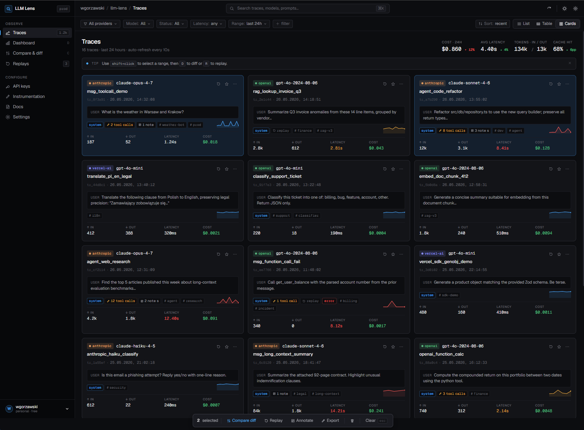
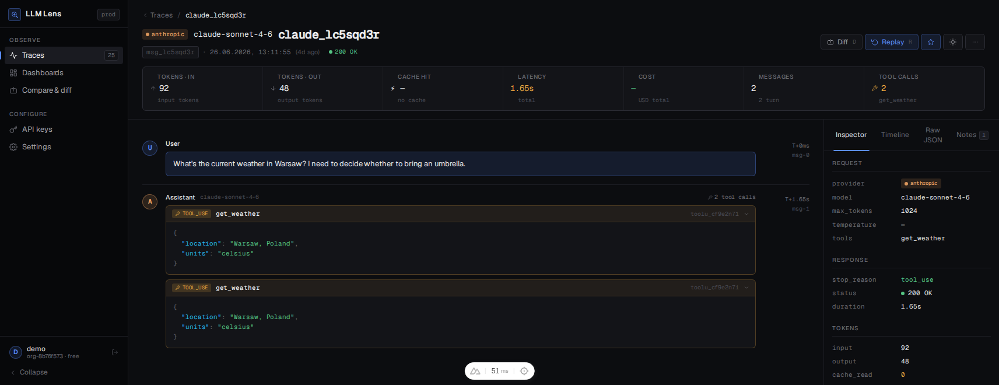

# LLM Lens

[](https://github.com/wgorzawski/llm-lens/actions/workflows/ci.yml)

A tool for ingesting, storing, and visualizing LLM API traces. Supports Anthropic, OpenAI, and Vercel AI SDK logs and normalizes them into a unified format for side-by-side inspection.

**[→ llm-lens landing page](https://wgorzawski.github.io/llm-lens/)**

## Screenshots

### Trace list


### Trace detail


## Features

- **Unified trace format** — Anthropic, OpenAI, and Vercel AI logs normalized to a single `UnifiedTrace` schema
- **Chat-style visualization** — role-aware message bubbles (user / assistant / tool)
- **Tool call inspection** — collapsible blocks showing tool name, JSON input, and results
- **System prompt viewer** — collapsible, shown once at the top of the thread
- **Usage stats** — input/output tokens, cache hits (⚡), and latency per trace
- **Provider filter + pagination** — filter by provider, navigate large trace sets
- **Raw JSON access** — full original log available at the bottom of every detail page
- **REST API** — ingest traces programmatically from any language or SDK
- **Auto-instrumentation** — `@llm-lens/instrument` patches your OpenAI or Anthropic client in-place; every call is captured with zero changes to your application logic

## Tech stack

| Layer | Technology |
|---|---|
| Frontend | Nuxt 4, Vue 3, UnoCSS |
| Backend | Fastify 4, fastify-decorators |
| Database | SQLite via Drizzle ORM + `@libsql/client` |
| Parsers | Pure TypeScript, zero runtime deps |
| Tests | Vitest (60 tests) |
| Monorepo | pnpm workspaces |

## Project structure

```
llm-lens/
├── apps/
│   ├── api/                    # Fastify REST API (port 3001)
│   │   └── src/
│   │       ├── controllers/    # Route handlers with @Controller decorators
│   │       └── db/             # Drizzle schema, client, repository
│   ├── web/                    # Nuxt 4 frontend (port 3000)
│   │   └── app/
│   │       ├── components/     # ProviderBadge, MessageBubble, ToolCallBlock, …
│   │       ├── composables/    # useTraces, useTrace
│   │       └── pages/          # / (list), /traces/[id] (detail)
│   └── playground/             # Vite + Vue demo client (port 5173)
└── packages/
    ├── types/                  # @llm-lens/types — UnifiedTrace + provider schemas
    ├── parsers/                # @llm-lens/parsers — parseAnthropicLog, parseOpenAILog, parseVercelAILog
    └── instrument/             # @llm-lens/instrument — auto-instrumentation wrappers (OpenAI, Anthropic)
```

## Getting started

### Prerequisites

- Node.js ≥ 24
- pnpm ≥ 11

### Install

```bash
git clone https://github.com/wgorzawski/llm-lens.git
cd llm-lens
pnpm install
```

### Build shared packages

```bash
pnpm --filter @llm-lens/types build
pnpm --filter @llm-lens/parsers build
pnpm --filter @llm-lens/instrument build
```

### Run

Start both servers in separate terminals:

```bash
# Terminal 1 — API (port 3001)
pnpm --filter @llm-lens/api dev

# Terminal 2 — Frontend (port 3000)
pnpm --filter @llm-lens/web dev
```

Open [http://localhost:3000](http://localhost:3000).

The SQLite database is created automatically at `./llm-lens.db` on first run. Override with:

```bash
DATABASE_URL=file:/path/to/custom.db pnpm --filter @llm-lens/api dev
```

## Auto-instrumentation

`@llm-lens/instrument` is the easiest way to capture traces from your own code. It patches your provider client in-place so that every API call is forwarded to llm-lens automatically — no changes to your existing call sites, no wrapper functions, no manual logging.

**This is not a connector to ChatGPT, Claude.ai, or any other chat interface.** It captures calls that _your own code_ makes to the provider API. If you have a script, backend, agent, or RAG pipeline that calls OpenAI or Anthropic, wrapping the client is all it takes to see every prompt and response in llm-lens.

### How it works

Each `instrument*` function replaces the relevant `create` method with a thin wrapper. The wrapper:

1. Calls the real provider API as usual and returns the response to your code unchanged
2. Records the wall-clock duration
3. Sends the full request + response to llm-lens in the background (fire-and-forget — your code does not wait for this)

If the llm-lens server is unreachable the error is swallowed silently, or forwarded to your `onError` handler. Instrumentation never throws and never slows down your application.

### OpenAI

Install the package in your project:

```bash
pnpm add @llm-lens/instrument openai
```

Wrap your client once at startup:

```ts
import OpenAI from "openai";
import { instrumentOpenAI } from "@llm-lens/instrument";

const client = instrumentOpenAI(new OpenAI(), {
  apiUrl: "http://localhost:3001",
  apiKey: "your-api-key",
});

// Every call below is now captured automatically
const response = await client.chat.completions.create({
  model: "gpt-4o",
  messages: [{ role: "user", content: "Hello" }],
});
```

### Anthropic

```bash
pnpm add @llm-lens/instrument @anthropic-ai/sdk
```

```ts
import Anthropic from "@anthropic-ai/sdk";
import { instrumentAnthropic } from "@llm-lens/instrument";

const client = instrumentAnthropic(new Anthropic(), {
  apiUrl: "http://localhost:3001",
  apiKey: "your-api-key",
});

// Every call below is now captured automatically
const response = await client.messages.create({
  model: "claude-sonnet-4-6",
  max_tokens: 1024,
  messages: [{ role: "user", content: "Hello" }],
});
```

The API key is either a JWT token (copy from browser `localStorage` key `llm_lens_token` after OAuth login) or a `llmlens_sk_…` key generated in the settings page.

### Options

| Option | Type | Required | Description |
|---|---|---|---|
| `apiUrl` | `string` | yes | llm-lens API base URL, e.g. `http://localhost:3001` |
| `apiKey` | `string` | yes | JWT token or `llmlens_sk_…` API key |
| `onError` | `(err: unknown) => void` | no | Called when trace submission fails. Silent by default. |

### Limitations

- **Streaming is not captured.** Calls with `stream: true` are passed through untouched. Collecting a streaming response would require buffering the entire stream before returning it, which would change the timing semantics for your code.
- **Only `chat.completions.create` (OpenAI) and `messages.create` (Anthropic) are patched.** Other endpoints (embeddings, images, etc.) are not affected.
- **Requires Node.js ≥ 18** for the built-in `fetch` used to submit traces.

## Playground

`apps/playground` is a minimal Vite + Vue app that demonstrates end-to-end instrumentation. It simulates an external application that uses llm-lens to observe its LLM calls.

```bash
pnpm --filter @llm-lens/playground dev
# → http://localhost:5173
```

Open **Config**, paste your LLM Lens API key alongside your Anthropic and OpenAI keys (stored in `localStorage`), then type a prompt and click **Send to all providers**. Both providers are called in parallel via their instrumented clients — traces appear in the main llm-lens UI at `http://localhost:3000` immediately.

## API reference

Base URL: `http://localhost:3001/api`

### Ingest a trace

```http
POST /traces/anthropic
POST /traces/openai
POST /traces/vercel-ai
Content-Type: application/json
```

Body is the raw request + response log for that provider (see [provider schemas](#provider-schemas)). Returns the normalized `UnifiedTrace` with HTTP 201.

### List traces

```http
GET /traces?limit=50&offset=0&provider=anthropic
```

| Query param | Type | Default | Description |
|---|---|---|---|
| `limit` | number | `50` | Max results (cap: 200) |
| `offset` | number | `0` | Pagination offset |
| `provider` | string | — | Filter: `anthropic` \| `openai` \| `vercel-ai` |

Response:

```json
{
  "traces": [...],
  "total": 42,
  "limit": 50,
  "offset": 0
}
```

### Get a trace

```http
GET /traces/:id
```

### Delete a trace

```http
DELETE /traces/:id
```

### Health check

```http
GET /health
→ { "status": "ok" }
```

## Provider schemas

### Anthropic

```json
{
  "request": {
    "model": "claude-sonnet-4-6",
    "messages": [{ "role": "user", "content": "Hello" }],
    "system": "You are helpful.",
    "max_tokens": 1024
  },
  "response": {
    "id": "msg_01abc",
    "type": "message",
    "role": "assistant",
    "content": [{ "type": "text", "text": "Hi there!" }],
    "model": "claude-sonnet-4-6",
    "stop_reason": "end_turn",
    "stop_sequence": null,
    "usage": { "input_tokens": 12, "output_tokens": 5 }
  },
  "timestamp": 1715700000000,
  "durationMs": 320
}
```

### OpenAI

```json
{
  "request": {
    "model": "gpt-4o",
    "messages": [
      { "role": "system", "content": "You are helpful." },
      { "role": "user", "content": "Hello" }
    ]
  },
  "response": {
    "id": "chatcmpl-abc",
    "object": "chat.completion",
    "created": 1715700000,
    "model": "gpt-4o-2024-08-06",
    "choices": [{
      "index": 0,
      "message": { "role": "assistant", "content": "Hi there!" },
      "finish_reason": "stop"
    }],
    "usage": { "prompt_tokens": 17, "completion_tokens": 5, "total_tokens": 22 }
  },
  "durationMs": 410
}
```

### Vercel AI SDK

```json
{
  "type": "ai.generateText",
  "operationId": "op-abc",
  "model": "gpt-4o-mini",
  "provider": "openai",
  "timestamp": 1715700000000,
  "durationMs": 190,
  "input": {
    "system": "You are helpful.",
    "messages": [{ "role": "user", "content": "Hello" }]
  },
  "output": {
    "text": "Hi there!",
    "finishReason": "stop"
  },
  "usage": { "promptTokens": 12, "completionTokens": 5, "totalTokens": 17 }
}
```

## Development

### Run tests

```bash
pnpm --filter @llm-lens/parsers test
# 60 tests: 15 Anthropic · 20 OpenAI · 25 Vercel AI
```

### Add a new provider parser

1. Add raw log types to `packages/types/src/providers/<provider>.ts` and export from `packages/types/src/index.ts`
2. Create `packages/parsers/src/<provider>.ts` implementing `parse<Provider>Log(raw): ParseResult`
3. Export from `packages/parsers/src/index.ts`
4. Add a `POST /traces/<provider>` handler in `apps/api/src/controllers/traces.controller.ts`
5. Add tests in `packages/parsers/src/__tests__/<provider>.test.ts`

### Typecheck all packages

```bash
pnpm typecheck
```

## Contributing

Contributions are welcome. Please open an issue before submitting a PR for non-trivial changes — it helps avoid duplicate work and misaligned direction.

- **Bug fixes** — open a PR directly with a short description of the problem and the fix
- **New features** — open an issue first to discuss scope and approach
- **New provider parsers** — follow the steps in [Add a new provider parser](#add-a-new-provider-parser); include tests
- **Roadmap items** — check the [landing page](https://wgorzawski.github.io/llm-lens/) for planned features before starting

All parser changes must pass `pnpm --filter @llm-lens/parsers test` with no regressions.
